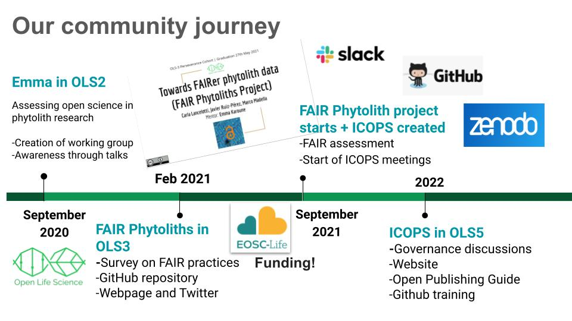
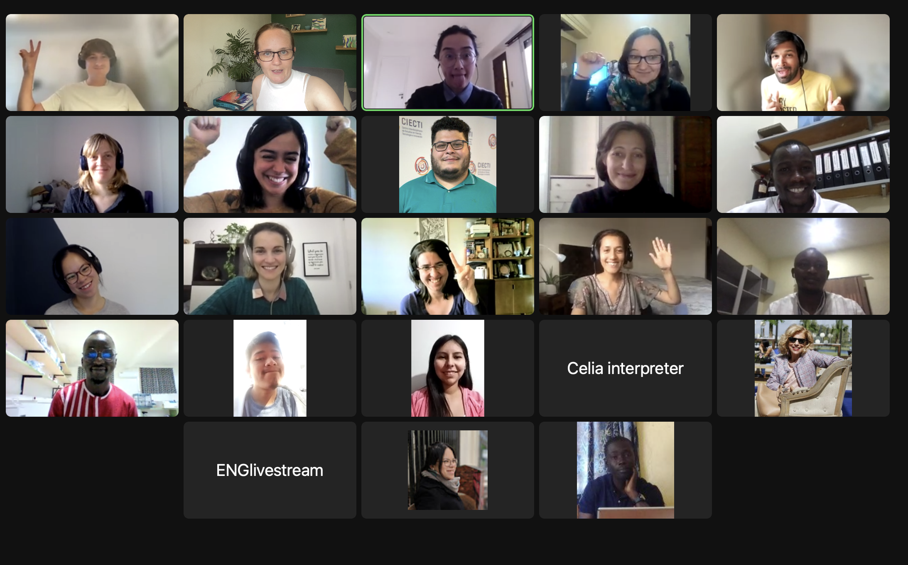

<!--more-->

El 20 de julio de 2022 el Comité Internacional de Ciencia Abierta de Fitolitos 
participó en la ceremonia de graduación de la cohorte 5 del programa Open Life Science (OLS-5)
[enlace de youtube con el evento](https://www.youtube.com/watch?v=9XMGsmekddM). 
Nuestro proyecto denominado Comité Internacional de Ciencia Abierta de Fitolitos: 
iniciativa de construcción de la comunidad y formación en ciencia abierta para la 
Comunidad de Fitolitos, tuvo como objetivo formar a los miembros del comité de ICOPS 
en el uso de GitHub y en las prácticas de ciencia abierta. Dentro de esto último, 
focalizando en la construcción de un plan acciones, la generación de la infraestructura 
[repositorio GitHub](https://github.com/open-phytoliths) y
[sitio web](open-phytoliths.netlify.app), así como el uso de diferentes herramientas 
-Open canvas y Hoja de ruta-para la formación e inclusión de los diferentes miembros de 
la comunidad de fitolitos a nivel global.

Al interior de nuestro comité, realizamos debates sobre la gobernanza, así como reflexiones 
sobre diferentes tipos de aspectos. Uno de los más necesarios, tiene que ver sobre la posibilidad 
de realizar encuestas y encuentros que nos permitan conocer la realidad local de los y las investigadores, 
así como aquello qué les incentiva o no a trabajar dentro del movimiento de los “datos abiertos”.

Queríamos agradecer a los y las organizadores del OLS-5 y a todos y todas aquellos que participaron en 
la cohorte5. Un especial agradecimiento a nuestras mentoras, Malvika y Gracielle por su apoyo contante 
y por compartir sus ideas y experiencias para desarrollar nuestro proyecto
During our training at OLS5 we developed our motto: 

Durante nuestra formación en el OLS5 elaboramos nuestro lema: 

Construir una visión compartida para la adopción e implementación de la ciencia abierta entre los investigadores de fitolitos a nivel global

*Escrito por Gabi Musaubach, con la ayuda de las traducciones de Celine Kerfant y Emma Karoune.*

<!--more-->

