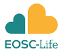

<!--more-->

El Comité Internacional en Cienca Abierta de Fitolitos (ICOPS por su sigla en inglés International Committee of Open Phytolith Science), está organizando una serie de talleres sobre "Herramientas para la investigación en Acceso Abierto",  disponible para todos/as los/las interesados/as. Utilizaremos ejemplos y casos de estudios en plantas vinculados con los distintos campos de las paleociencias (por ejemplo, arqueobotánica, paleoecologia). Sin embargo, la mayoría de las charlas y ejercicios serán de carácter general, por lo que serán útiles para todos los y las investigadores/as.

**Lista de talleres en Herramientas de Investigación Abierta**
- 24 de febrero de 2023 - Publicación en acceso abierto 
- 24 de marzo de 2023 - Uso de repositorios 
- 21 de abril de 2023 - Conceptos básicos de Github 
- 28 de abril de 2023 - Flujos de trabajo colaborativos en Github
- 26 de mayo de 2023 - Vocabularios estándar y ontologías 
- 30 de junio de 2023 - Datos FAIR (Encontrables, Accesibles, Interoperables y Reutilizables, por su sigla en inglés Findable, Accessible, Interoperable, Reusable)

Todos los talleres tendrán lugar los días viernes de 14:00 a 16:00 GMT (ver fechas arriba). 

Los talleres serán una combinación de charlas cortas, debates y ejercicios prácticos. 
Consulte [este documento](https://docs.google.com/document/d/1jhWKjbDcLaCtiSbBGuC2L0Wq-gJmaNhztisFgwUKhn8/edit?usp=sharing) para obtener más detalles sobre lo que se incluirá en cada taller.

Los documentos compartidos y las diapositivas utilizadas en la formación estarán disponibles antes de cada taller. Todos los recursos utilizados en la formación, incluidos los vídeos de los talleres, estarán disponibles abiertamente a través de nuestro sitio web como cursos de autoaprendizaje a finales de junio de 2023.

Todos los talleres se dictarán en inglés, pero tenemos la posibilidad de proporcionar los materiales del curso y, en algunos talleres, traducción en directo en algunos idiomas. Por favor, indique si así lo requiere en el formulario de inscripción. 

**Para inscribirse en los talleres, por favor utilice este formulario: https://forms.gle/sDfATd4Vzz19abDw7**

O envíenos un correo electrónico a (open.phytoliths@gmail.com) para que podamos inscribirlo y añadirle a la lista. 

¡Los esperamos a todos/as!

International Committee of Open Phytolith Science (ICOPS)

*Emma Karoune (Committee Chair), Doris Barboni, Jennifer Bates, Abraham Dabengwa, Zachary C. Dunseth, Juan José García-Granero, Yong Ge, Celine Kerfant, Carla Lancelotti, Marco Madella, Maria Gabriela Musaubach, Javier Ruiz-Pérez.*

<!--more-->

Esta iniciativa ha sido financiada por EOSC-Life (referencia APPID2596). EOSC-Life ha recibido financiación del programa Horizonte 2020 de la Unión Europea en virtud del acuerdo de subvención número 824087.
