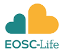

<!--more-->

国际植硅体开放科学委员会(ICOPS)正在组织一系列面向所有人的开放研究技能研讨会。我们将使用与植物相关的科学领域的例子和案例研究(例如，古植物学，古生态学)，但大多数的讲座和练习将是通用的，因此对所有研究人员都有用。

开放研究技能培训工作坊内容列表

2023年2月24日-开放获取出版
2023年3月24日-使用存储库
2023年4月21日- GitHub基础
2023年4月28日- GitHub协作工作流
2023年5月26日-标准词汇表和本体
2023年6月30日- FAIR数据

所有的研讨会将在周五14:00至16:00 GMT（北京时间22:00-24:00）举办。

研讨会将结合简短的谈话、讨论和实践练习。
[请参阅](https://docs.google.com/document/d/1jhWKjbDcLaCtiSbBGuC2L0Wq-gJmaNhztisFgwUKhn8/edit?usp=sharing)
《开放研究培训研讨会的详细信息》以了解每个研讨会将包括的细节。

培训中使用的共享文件和幻灯片将在每次研讨会前提供。培训中使用的所有资源，包括研讨会视频，将于2023年6月底前通过我们的网站作为自学课程公开提供。 

所有的研讨会都将用英语进行，但我们有能力提供课程材料，在一些研讨会上，还可能根据参会人数提供几种语言的现场翻译。请在报名表上注明是否需要（请填报名表后发送给open.phytoliths@gmail.com或yongge@ucas.ac.cn）。 

或随时给我们发电子邮件(open.phytoliths@gmail.com)，以便我们将您添加到列表中。 

期待在培训会中见到大家!
国际植硅体开放科学委员会
International Committee of Open Phytolith Science (ICOPS)

Emma Karoune (Committee Chair), Doris Barboni, Jennifer Bates, Abraham Dabengwa, Zachary C. Dunseth, Juan José García-Granero, Yong Ge, Celine Kerfant, Carla Lancelotti, Marco Madella, Maria Gabriela Musaubach, Javier Ruiz-Pérez.

<!--more-->

This initiative has been funded by EOSC-Life (reference APPID2596). EOSC-Life has received funding from the European Union’s Horizon 2020 programme under grant agreement number 824087.
